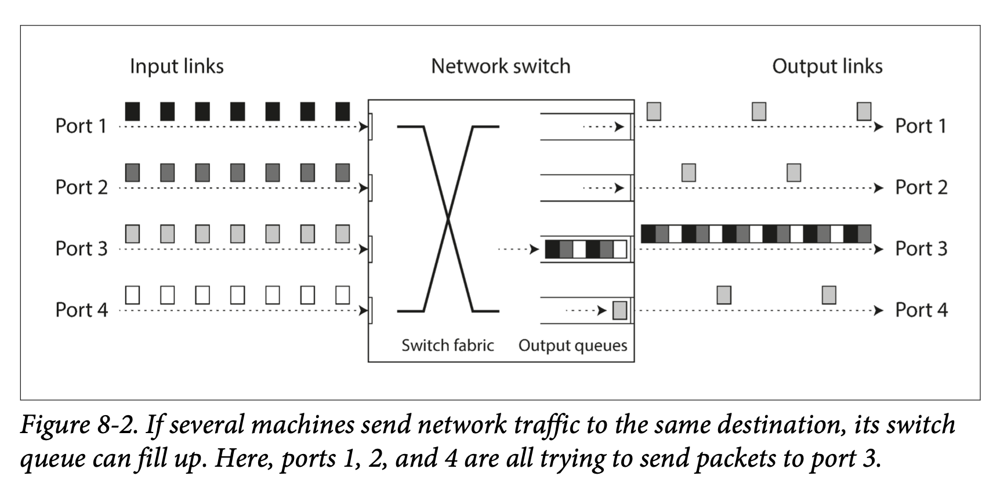

#### 3. Timeouts and Unbounded Delays
超时时间长，意味着用户只能等待或者拿到错误信息。超时时间短，容易出现误判节点失效（节点可能由于性能波动，导致网络延时高）。

其它影响：
* 如果节点存活，但是请求操作不能保证幂等性，则会导致一些操作执行两次，很有可能导致正确性问题。
* 当节点失败时，其承担的职责需要交给其它节点，该过程会给其它节点带来额外的负担，甚至可能拖垮整个系统。

##### Network congestion and queueing
计算机网络上数据包延迟取决于排队：
* 当多个不同节点同时发送数据包到相同的目标节点时， 网络交换机会出现排队，然后依次将数据包转发到目标网络，可能引起网络负载过重。如果数据量太大， 交换机队列塞满， 之后的数据包则会被丢弃， 网络还在运转， 但会引发大量数据包重传。
* 当数据包到达目标机器后， 如果所有CPU核都处于繁忙状态， 则网络数据包请求会被操作系统排队， 直到应用程序能够处理。
* 在虚拟化环境下， CPU 核会切换虚拟机， 从而导致正在运行的操作系统会突然暂停几十毫秒。 在这段时间， 客户虚机无法从网络中接收任何数据， 入向的包会被虚拟机管理器排队缓冲， 进一步增加了网络延迟的不确定性。
* TCP执行流量控制（也称为拥塞消除， 或背压）时， 节点会主动限制自己的发送速率以避免加重网络链路或接收节点负载。数据包发送前，可能已经开始了排队。

在公有云和多租户数据中心中，用户共享网络资源（交换机，机器网卡和 CPU），批处理任务容易使网络带宽饱和，如果无法控制或者无权限观测其它用户对共享资源的使用情况，则会造成高网络延迟。

这种情况下，需要通过多次实验，试探性的确定延迟的大致范围，在故障检测和过早超时风险之间选择一个合适的中间值。

更好的做法：持续测批响应时间及其变化 （抖动），然后根据最新的响应时间分布来自动调整。 可以用 Phi Accrual 故障检测器完成，该检测器目前已经在 Akka 和 Cassandra 中使用，TCP 超时重传也采用了类似的机制。