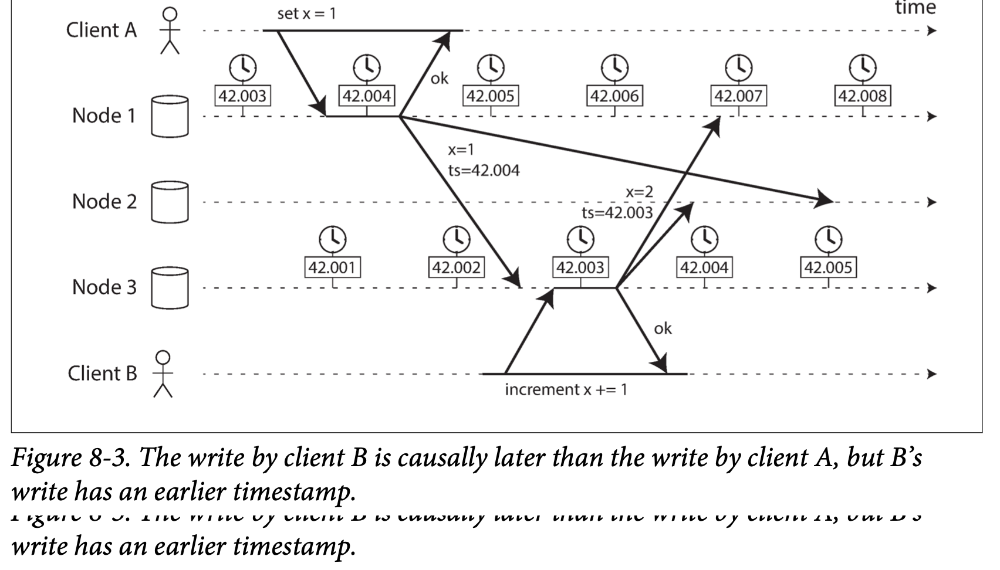

#### 2. Clock Synchronization and Accuracy
硬件时钟和 NTP 可能会出现一些奇怪的现象：
1. 机器自身故障。
	* 计算机中的石英钟不够精确，存在漂移现象（运行速度会变快或变慢），时钟漂移取决于机器的温度。
	* 时钟与 NTP 服务器的时钟差别过大，会出现拒绝同步，或者本地时钟将被强制重制。重制后应用程序观察可能会看到时间突然倒退或者跳跃。
2. NTP 问题
	* 防火墙可能导致与 NTP 服务器链接失败。
	* NTP 同步易受限于网络环境，以及 NTP 服务自身配置或者故障。
3. 其它问题
	* 闰秒现象。
	* 虚拟机中的硬件时钟是虚拟化的，虚拟机切换时，易发生停顿。
	* 某些未完全可控的设备，硬件始终不可行。

高精度时钟方案：采用 GPS 接收机，精确时钟协议（PTP）并辅以细致的部署和检测。代价：资源投入和技术门槛。

#### 3. Relying on Synchronized Clocks
某些高度依赖于精确时钟的软件，如果出现了时间偏差，后果可能是隐式的，造成的某些精度损失后果难以发现。

因此， 如果应用需要精确同步的时钟， 最好仔细监控所有节点上的时钟偏差。 如果某  
个节点的时钟漂移超出上限， 应将其宣告为失效， 并从集群中移除。

##### Timestamps for ordering events
跨节点的时间顺序，高度依赖时钟计时。如下例子，产生了增量操作丢失：
  

解决上述问题的常用策略是最后写入胜利（LWW），在多主节点和无主节点复制数据库中（如 Cassandra 和 Riak ）广泛使用。有些实现会在客户端生成时间戳而非服务器端，并未改变 LWW 的根本问题：
* 数据库写入丢失，后续的写操作无法覆盖更早的值，原因是后者节点的时钟太快了，导致一些数量未知的数据被悄悄的丢弃，并且不报错。
* LWW 无法区分连续快速发生的连续写操作，需要额外的因果关系跟踪机制（如版本向量）来防止因果冲突。
* 时间精度限制导致两个节点产生了相同的时间戳，常需要引入一个仲裁值，但仲裁值无法区分因果关系。

对于有时间先后顺序的事件，基于递增计数器的逻辑时钟（事件的相对顺序，即时间发生的先后前后顺序）更可靠。

##### Clock have a confidence interval
墙上时钟返回的纳秒级别的信息，不可信。

因此，时钟读数应该被视为一个精确的时间点， 而更应该视为带有置信区间的时间范围。

Google Spanner中的 TrueTime API，会明确的报告本地时钟的置信区间，当查询当前时间时， 会得到两个值：［不早于， 不晚千］分别代表误差的最大偏差范围。该间隔的范围主要取决于本地石英钟最后与高精时钟源同步后所经历的时间长短。

##### Synchronized clocks for global snapshots
分布式场景中的单调递增事务 ID，需要产生全局的、跨所有分区，单调递增的事务 ID。事务 ID 要求必须反映因果关系：事务 B 如果要读取事务 A 写入的值， 则 B 的事务ID必须大于 A 的事务ID，否则快照将不一致。 考虑到大量、 频繁的小数据包， 在分布式系统中创建事务 ID 通常会引入瓶颈。

Google Spanner 的思路：
1. 其根据  TrueTime API 返回的时钟置信区间，如果两个区间为发生重叠，才能判断两个失误的先后顺序。
2. 为了确保事务时间戳反映的因果关系，Spanner 在提交读写事务之前故意等待置信区间的长度。目的是确保所有读事务要足够晚才发生，避免与先前事务的置信区间产生重叠。为了缩短潜在的等待时间，Spanner 需要使时钟的误差范围经可能小，因此，Google 在每个数据中心都部署了一个 GPS 接收器或原子钟， 保证所有时钟同步在约7 ms 之内完成。