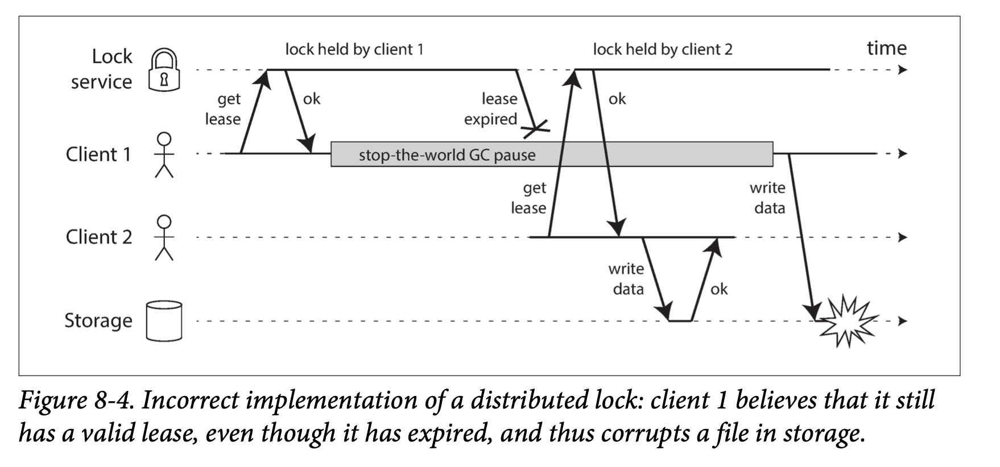
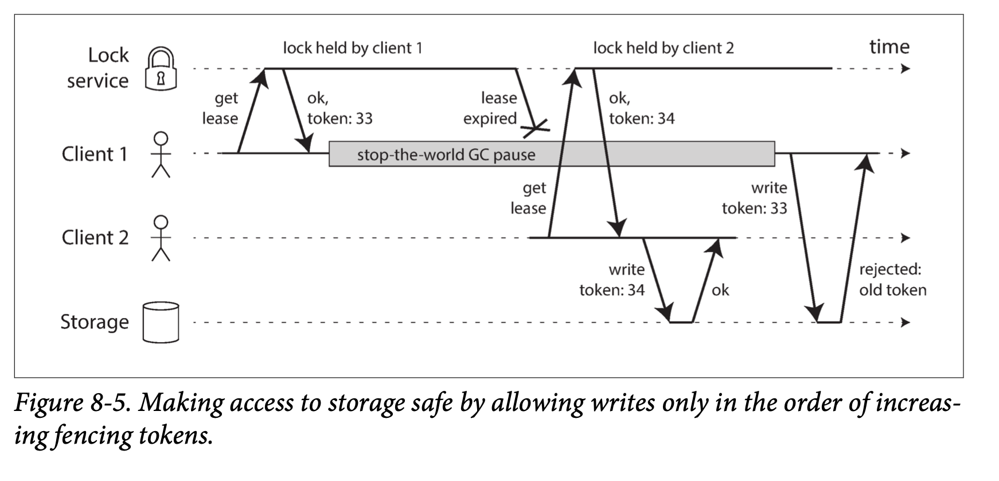

### Knowledge, Truth, and Lies
分布式系统中，我们获取的信息的真假如何测量，软件系统如何遵从物理世界的通用法则。

在分布式系统中，可以对系统行为可以做出若干假设，然后基于这些假设条件来构建实际运行的系统。在给定系统模型下，可以验证算法的正确性。

#### 1. The Truth Is Defined by the Majority
三种情况：
* 某个节点能收到发送给它的消息，但式该节点发出的消息要么被丢弃，要么被推迟i发送，其他节点无法收到响应，一定时间后，该节点会被声明为失效。
* 半断开的节点可能会注意到其发送的消息没有被其他节点所确认， 因此意识到网络一定发生了某种故障。 尽管如此， 节点还是会被其他节点错误地宣告为失效。
* 该节点上垃圾回收运行了很长时间，期间未处理任何请求，没有发送任何响应，最后只能不断重试，最后只能宣告该节点失效。

节点不能根据自身的信息来判断自身的状态，节点可能实时失效，暂停或者假死，甚至无法恢复。因此，分布式系统不能完全依赖于单个节点。目前， 许多分布式算法都依靠法定票数， 即在节点之间进行投票，何决策都需要来自多个节点的最小投票数， 从而减少对特定节点的依赖。

##### The leader and the lock
分布式系统中某些角色只能有一个，如下：
* 只允许一个节点作为数据库分区的主节点，防止出现脑裂。
* 只允许一个事务或客户端持有特定资源的锁，防止同时写入导致数据被破坏。
* 只允许一个用户来使用特定的用户名，从而确定用户名可以标识用户。

在分布式系统中，可能会出现某个节点自认为是主节点（或者持有锁）的情况，但是并没有系统决定票数的同意。情况如上所述。这种情况下，如果该节点继续工作，既有可能会导致系统错误的行为。

如下图，展示了 Hbase 的一个问题，设计目标是确保存储系统的文件一次只能由一个客户端访问，但如果多个客户端试图同时写入该文件，文件会被破坏；因此，在访问文件之前客户端需要从锁服务获取访问租约。下图中的问题是由于进程暂停导致的。

  

##### Fencing tokens
使用锁和租约机制来保护资源的并发访问时，必须要确保过期的"唯一角色" 不能影响其他节点。解决该问题的技巧为：fencing。

在每次授予客户端锁的时候，返回一个 fencing 令牌，该令牌数字每授予一次就会递增（例如，由锁服务增加）。然后要求客户端每次向存储系统发送写请求时，都必须包含所持有的 fencing 令牌。如果发现已经处理过更高令牌的请求， 服务端要拒绝持有低令牌的所有写请求。

  

当使用ZooKeeper作为锁服务时， 可以用事务标识 zxid 或节点版本 cversion 来充当fencing令牌， 这两个都可以满足单调递增的要求。

