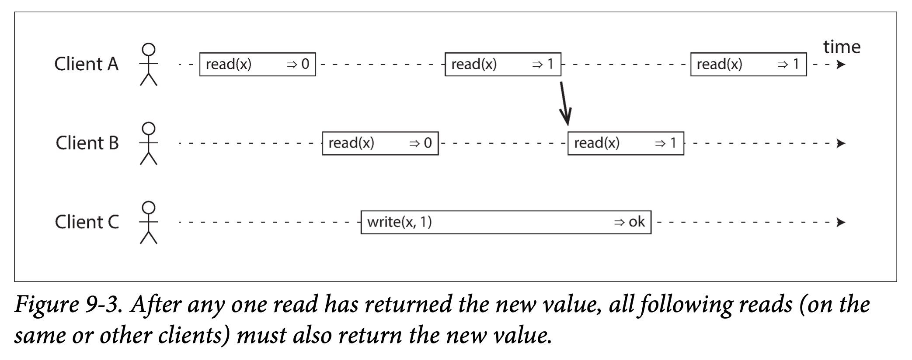
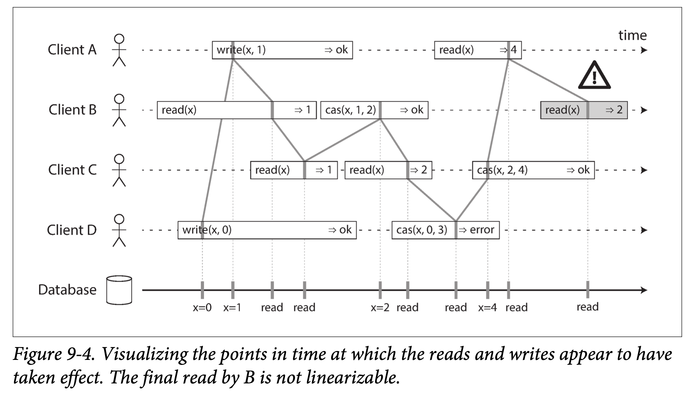

#### What Makes a System Linearizable?
如下图：
  

与写并发的读操作可能返回旧值或新值，一旦某个读操作返回了新值，之后所有的读（包括相同或不同的客户端）都必须返回新值。

在一个可线性化的系统中， 在写操作的开始与结束之间必定存在某个时间点， x 的值发生了从0到1的跳变。 如果某个客户端的读取返回了新值1，即使写操作尚未提交，那么所有后续的读取也必须全部返回新值。

可线性化要求：如果连接这些标记的竖线，必须按时间箭头（从左到右）向前移动，而不能向后移动。这确保了：一且新值被写入或读取，所有后续的读都看到的是最新的值， 直到被再次覆盖。
  

可串行化：数据库事务的隔离属性，用于确保事务的执行结果与串行之行的结果相同。
可线性化：是保证读写单个对象最新值保证，并不要求将操作组合到事务中，因此无法避免倾斜等问题。
数据库可以同时支持可串行化和可线性化，该组合被称为严格的可串行化或强的单副本可串行化（Strong one-copy serializability，Strong - ISR），2PL 和实际的串行执行都是可线性化。
