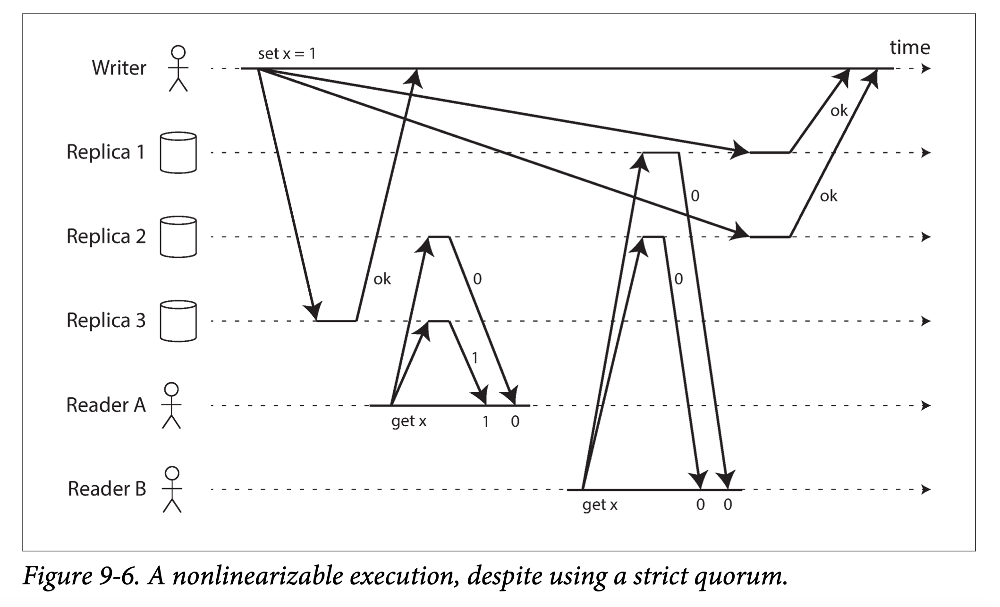

##### Linearizability and quorums
直觉上，对千Dynamo风格的复制模型，如果读写遵从了严格 quorum，应该是可线性化的。 然而如果遭遇不确定的网络延迟， 就会出现竞争条件，如下：
  

可以使 Dynamo 风格的复制系统以牺牲性能为代价来满足线性化： 读操作在返回结果给应用之前， 必须同步执行读修复；写操作在发送结果之前， 必须读取quorum节点以获取最新值。但会显著降低性能，Riak 并不支持同步读修复，Cassandra 确实会等待读修复完成，但其使用了 LWW，当出现同一个主键的并发写入时， 就会丧失线性化。

最安全的假定是类似 Dynamo 风格的无主复制系统无法保证线性化。