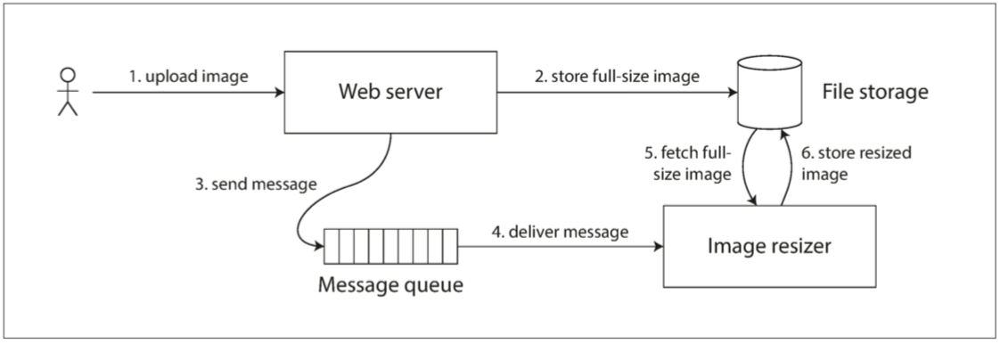

##### Cross-channel timing dependencies
例子：假设有一个网站，用户可以上传照片，一个后台进程会调整照片大小，降低分辨率以加快下载速度（缩略图），如下所示：

图像缩放器需要明确的指令来执行尺寸缩放作业，指令是 Web 服务器通过消息队列发送的。 Web 服务器不会将整个照片放在队列中，因为大多数消息代理都是针对较短的消息而设计的，而一张照片的空间占用可能达到几兆字节。取而代之的是，首先将照片写入文件存储服务，写入完成后再将给缩放器的指令放入消息队列。

  

如果文件存储服务是线性一致的，那么这个系统应该可以正常工作。如果它不是线性一致的，则存在竞争条件的风险：消息队列（可能比存储服务内部的复制（replication）更快。在这种情况下，当缩放器读取图像（步骤 5）时，可能会看到图像的旧版本，或者什么都没有。如果它处理的是旧版本的图像，则文件存储中的全尺寸图和缩略图就产生了永久性的不一致。

出现该问题的原因：因为 Web 服务器和缩放器之间存在两个不同的信道：文件存储与消息队列。