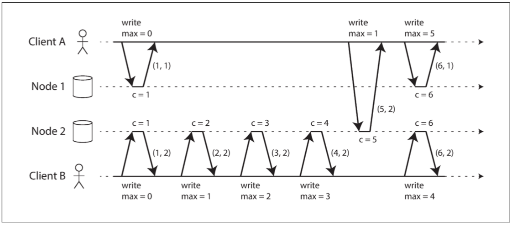

##### Lamport timestamps
Lamport 时间戳提供了与因果关系一致的全序：
每个节点都有一个唯一标识符，和一个保存自己执行操作数量的计数器。 兰伯特时间戳就是两者的简单组合：（计数器，节点 ID）。两个节点有时可能具有相同的计数器值，但通过在时间戳中包含节点 ID，每个时间戳都是唯一的。
兰伯特时间戳与物理的日历时钟没有任何关系，但是它提供了一个全序：如果你有两个时间戳，则 **计数器** 值大者是更大的时间戳。如果计数器值相同，则节点 ID 越大的，时间戳越大。

  

每个节点和每个客户端跟踪迄今为止所见到的最大 **计数器** 值，并在每个请求中包含这个最大计数器值。当一个节点收到最大计数器值大于自身计数器值的请求或响应时，它立即将自己的计数器设置为这个最大值。

只要每一个操作都携带着最大计数器值，这个方案确保兰伯特时间戳的排序与因果一致，因为每个因果依赖都会导致时间戳增长。

Lamport 时间戳 和 版本向量 区别，目的不同：
* 版本向量可以区分两个操作是并发的，还是一个因果依赖另一个
* 兰伯特时间戳总是施行一个全序。从兰伯特时间戳的全序中，你无法分辨两个操作是并发的还是因果依赖的。