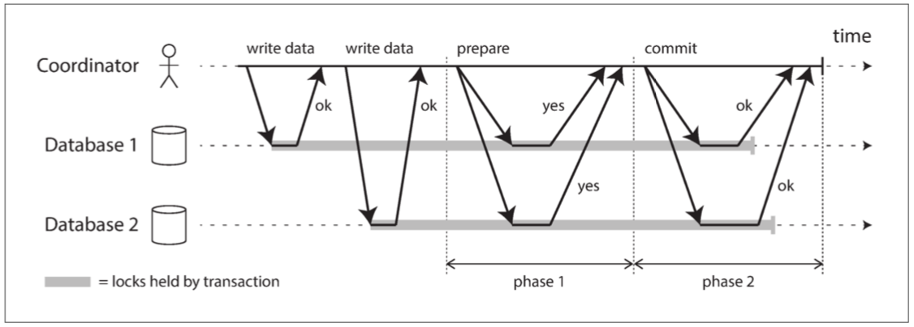

##### Introduction to two-phase commit
**两阶段提交（two-phase commit）** 是一种用于实现跨多个节点的原子事务提交的算法，即确保所有节点提交或所有节点中止。

  

正常情况下，2PC 事务以应用在多个数据库节点上读写数据开始。我们称这些数据库节点为 **参与者（participants）**。当应用准备提交时，协调者开始阶段 1 ：它发送一个 **准备（prepare）** 请求到每个节点，询问它们是否能够提交。然后协调者会跟踪参与者的响应：
- 如果所有参与者都回答 “是”，表示它们已经准备好提交，那么协调者在阶段 2 发出 **提交（commit）** 请求，然后提交真正发生。
- 如果任意一个参与者回复了 “否”，则协调者在阶段 2 中向所有节点发送 **中止（abort）** 请求。