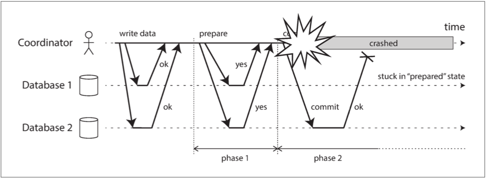

##### Coordinator failure
如果参与者之一或网络发生故障时会发生什么情况：如果任何一个 **准备** 请求失败或者超时，协调者就会中止事务。如果任何提交或中止请求失败，协调者将无条件重试。

如果协调者在发送 **准备** 请求之前失败，参与者可以安全地中止事务。但是，一旦参与者收到了准备请求并投了 “是”，就不能再单方面放弃 —— 必须等待协调者回答事务是否已经提交或中止。如果此时协调者崩溃或网络出现故障，参与者什么也做不了只能等待。参与者的这种事务状态称为 **存疑（in doubt）** 的或 **不确定（uncertain）** 的。

如下图所示：如果数据库 1 在超时后单方面中止，它将最终与执行提交的数据库 2 不一致。同样，单方面提交也是不安全的，因为另一个参与者可能已经中止了。
  

没有协调者的消息，参与者无法知道是提交还是放弃。原则上参与者可以相互沟通，找出每个参与者是如何投票的，并达成一致，但这不是 2PC 协议的一部分。

可行的方法：等待协调者恢复。协调者会将事务提交或中止决定写入磁盘上的事务日志。协调者恢复后，通过读取其事务日志来确定所有存疑事务的状态。任何在协调者日志中没有提交记录的事务都会中止。因此，2PC 的 **提交点** 归结为协调者上的常规单节点原子提交。

##### Three-phase commit
两阶段提交被称为 **阻塞（blocking）**- 原子提交协议，因为存在 2PC 可能卡住并等待协调者恢复的情况。理论上，可以使一个原子提交协议变为 **非阻塞（nonblocking）** 的，以便在节点失败时不会卡住。但是让这个协议能在实践中工作并没有那么简单。

3PC 在大多数具有无限网络延迟和进程暂停的实际系统中，并不能保证原子性。

非阻塞原子提交需要一个 **完美的故障检测器（perfect failure detector）**—— 即一个可靠的机制来判断一个节点是否已经崩溃。在具有无限延迟的网络中，超时并不是一种可靠的故障检测机制，因为即使没有节点崩溃，请求也可能由于网络问题而超时。出于这个原因，在存在协调者可能故障的情况下，2PC 仍然被使用。
