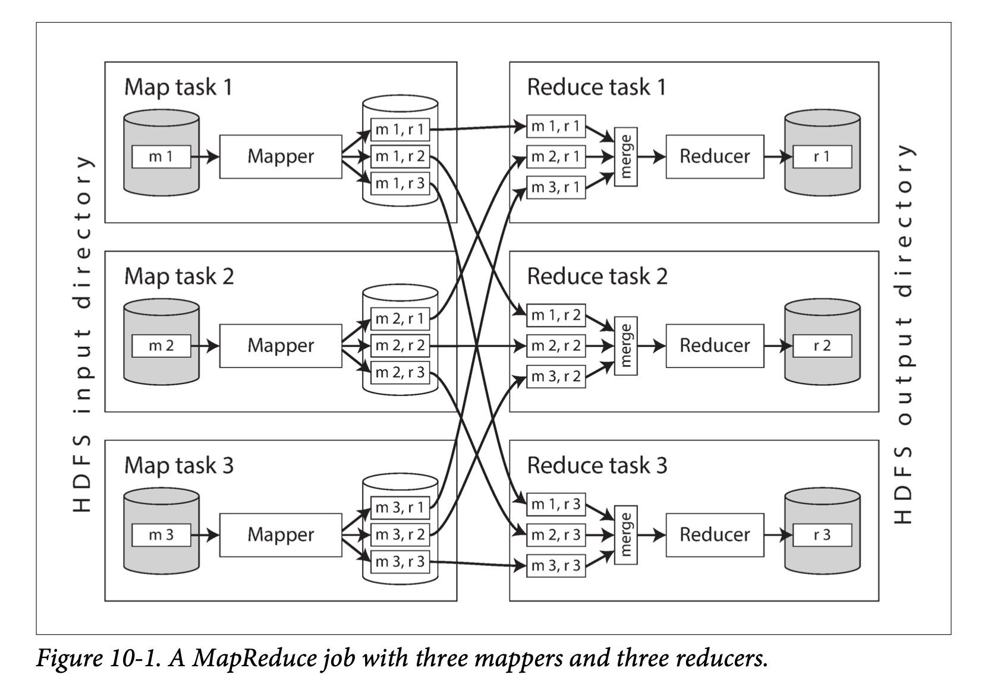

### MapReduce and Distributed Filesystems
MapReduce 作业可以和 Unix 进程相类比：它接受一个或多个输入，并产生一个或多个输出。

Unix 工具使用 `stdin` 和 `stdout` 作为输入和输出，但 MapReduce 作业在分布式文件系统上读写文件。常见的分布式文件系统：HDFS，GFS，GlusterFS 和 Quantcast File System（QFS）。
> 一个不同之处在于，对于 HDFS，可以将计算任务安排在存储特定文件副本的计算机上运行，而对象存储通常将存储和计算分开。如果网络带宽是一个瓶颈，从本地磁盘读取有性能优势。但是请注意，如果使用纠删码（Erasure Coding），则会丢失局部性，因为来自多台机器的数据必须进行合并以重建原始文件

HDFS 特点：
* HDFS 基于 **无共享** 原则，不需要特殊的硬件，只需要通过传统数据中心网络连接的计算机。
* HDFS 在每台机器上运行了一个守护进程，它对外暴露网络服务，允许其他节点访问存储在该机器上的文件（假设数据中心中的每台通用计算机都挂载着一些磁盘）。名为 **NameNode** 的中央服务器会跟踪哪个文件块存储在哪台机器上。因此，HDFS 在概念上创建了一个大型文件系统，可以使用所有运行有守护进程的机器的磁盘。

#### MapReduce Job Execution
##### Distributed execution of MapReduce
如下图，一个分布式场景下的 mapreduce：
  

执行流程：
1. Map 端根据输入文件数，启动多个 Map 任务，每个 Map 任务都按照 Reducer 对输出进行分区。每个分区都被写入 Mapper 程序的本地磁盘。
2. 只要当 Mapper 读取完输入文件，并写完排序后的输出文件，MapReduce 调度器就会通知 Reducer 可以从该 Mapper 开始获取输出文件。Reducer 连接到每个 Mapper，并下载自己相应分区的有序键值对文件。按 Reducer 分区，排序，从 Mapper 向 Reducer 复制分区数据，这一整个过程被称为 **shuffle**。
3. Reducer 调用时会收到一个键，和一个迭代器作为参数，迭代器会顺序地扫过所有具有该键的记录（因为在某些情况可能无法完全放入内存中）。Reducer 可以使用任意逻辑来处理这些记录，并且可以生成任意数量的输出记录。这些输出记录会写入分布式文件系统上的文件中。