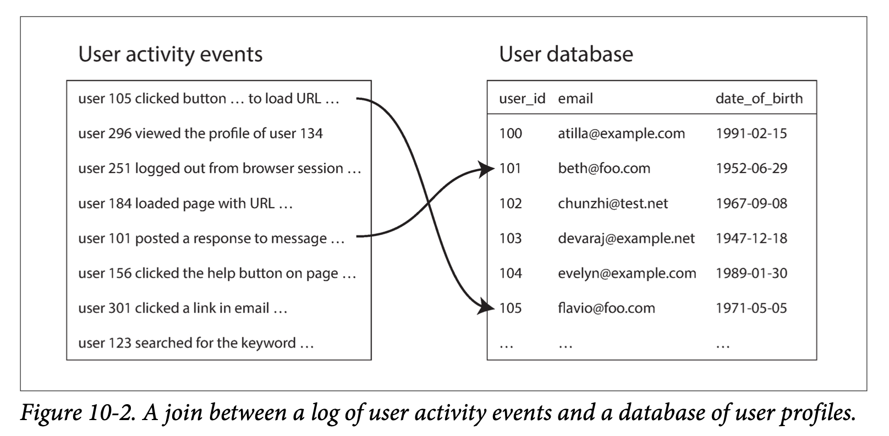
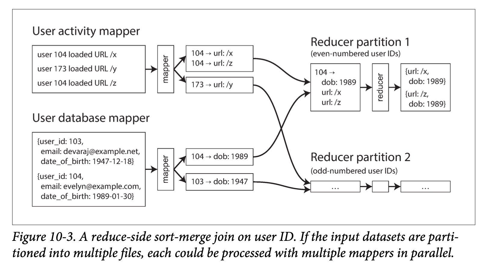

##### Example: analysis of user activity events
如下图：事件日志是事实表，用户数据库是其中的一个维度。
  

分析任务可能需要将用户活动与用户档案信息相关联。实现这一连接的最简单方法是，逐个遍历活动事件，并为每个遇到的用户 ID 查询用户数据库。但该方法的性能非常差：处理吞吐量将受限于受数据库服务器的往返时间，本地缓存的有效性很大程度上取决于数据的分布，并行运行大量查询可能会轻易压垮数据库。

为了在批处理过程中实现良好的吞吐量，计算必须（尽可能）限于单台机器上进行。为待处理的每条记录发起随机访问的网络请求实在是太慢了。而且，查询远程数据库意味着批处理作业变为 **非确定的（nondeterministic）**，因为远程数据库中的数据可能会改变。

更好的方法是获取用户数据库的副本，并将它和用户行为日志放入同一个分布式文件系统中。然后将用户数据库存储在 HDFS 中的一组文件中，而用户活动记录存储在另一组文件中，并能用 MapReduce 将所有相关记录集中到同一个地方进行高效处理。

##### Sort-merge joins
如下图：
* Mapper 对 Key 输出分区，然后对键值对进行排序时，效果是具有相同 ID 的所有活动事件和用户记录在 Reducer 输入中彼此相邻。
* Reducer 执行实际的连接逻辑。
* 由于 Reducer 一次处理一个特定用户 ID 的所有记录，因此一次只需要将一条用户记录保存在内存中，而不需要通过网络发出任何请求。这个算法被称为 **排序合并连接（sort-merge join）**，因为 Mapper 的输出是按键排序的，然后 Reducer 将来自连接两侧的有序记录列表合并在一起。
  
